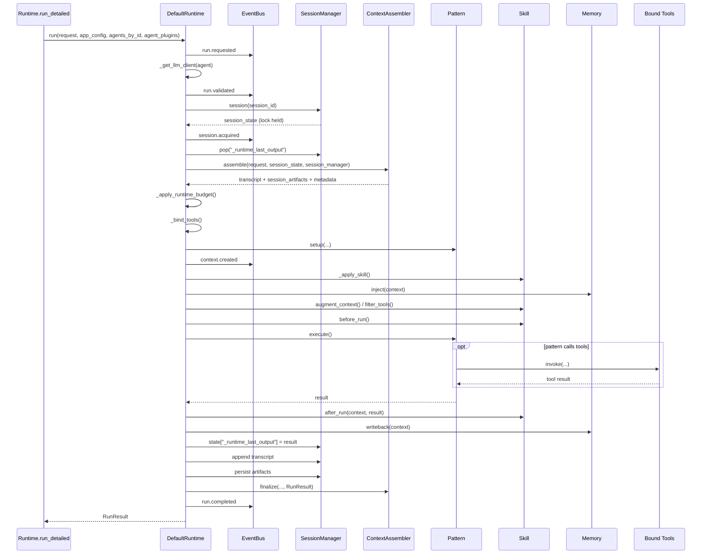

# OpenAgents SDK

配置驱动、异步优先、插件化的 Agent SDK。

## 它解决什么问题

OpenAgents 把一个 Agent loop 拆成可替换的组件：

```text
Input -> Pattern -> Tool / LLM -> Memory -> Output
```

运行时主要分成三层：

- Agent 级组件：`memory`、`pattern`、`skill`、`tools`
- Agent 级执行 seam：`tool_executor`、`execution_policy`、`context_assembler`
- App 级组件：`runtime`、`session`、`events`
- 可选 Provider 集成：`llm`
- 一次 `run` 只执行一个 `agent_id`；多 agent 是配置选择面，不是内置 multi-agent 编排

这样做的好处是：配置清晰、执行路径明确、组件可测试、替换成本低。

## 安装

基础安装：

```bash
uv add openagents-sdk
```

按需安装 extras：

```bash
uv add "openagents-sdk[openai]"
uv add "openagents-sdk[mem0]"
uv add "openagents-sdk[mcp]"
uv add "openagents-sdk[all]"
```

仓库开发环境：

```bash
uv sync --extra dev
```

## 快速开始

最小配置：

```json
{
  "version": "1.0",
  "agents": [
    {
      "id": "assistant",
      "name": "demo-agent",
      "memory": {"type": "window_buffer", "on_error": "continue"},
      "pattern": {"type": "react"},
      "llm": {"provider": "mock"},
      "tools": [
        {"id": "search", "type": "builtin_search"}
      ]
    }
  ]
}
```

异步调用：

```python
import asyncio
from openagents import Runtime


async def main() -> None:
    runtime = Runtime.from_config("agent.json")
    result = await runtime.run(
        agent_id="assistant",
        session_id="demo",
        input_text="hello",
    )
    print(result)


asyncio.run(main())
```

同步调用：

```python
from openagents import run_agent

result = run_agent(
    "agent.json",
    agent_id="assistant",
    session_id="demo",
    input_text="hello",
)
print(result)
```

## 对外 API

`openagents` 包当前直接导出：

- 运行入口：`Runtime`、`load_config`、`run_agent`、`run_agent_with_config`
- 装饰器：`tool`、`memory`、`pattern`、`runtime`、`skill`、`session`、`event_bus`
- 注册表查询：`get_tool`、`get_memory`、`get_pattern`、`get_runtime`、`get_skill`、`get_session`、`get_event_bus`
- 注册表列表：`list_tools`、`list_memories`、`list_patterns`、`list_runtimes`、`list_skills`、`list_sessions`、`list_event_buses`

## 内置组件

内置 memory：

- `buffer`
- `window_buffer`
- `mem0`
- `chain`

内置 pattern：

- `react`
- `plan_execute`
- `reflexion`

内置全局组件：

- runtime：`default`
- session manager：`in_memory`
- event bus：`async`

内置 tools：

- Search：`builtin_search`
- Files：`read_file`、`write_file`、`list_files`、`delete_file`
- Text：`grep_files`、`ripgrep`、`json_parse`、`text_transform`
- HTTP / network：`http_request`、`url_parse`、`url_build`、`query_param`、`host_lookup`
- System：`execute_command`、`get_env`、`set_env`
- Time：`current_time`、`date_parse`、`date_diff`
- Random：`random_int`、`random_choice`、`random_string`、`uuid`
- Math：`calc`、`percentage`、`min_max`
- MCP bridge：`mcp`

内置 agent 级执行 seam：

- Tool executor：`safe`
- Execution policy：`filesystem`
- Context assembler：`summarizing`

## 最重要的配置规则

- 顶层 `runtime`、`session`、`events` 选择的是 App 级实现。
- agent 内的 `runtime` 是运行参数，不是 runtime plugin 选择器。
- agent 内还可以声明 `tool_executor`、`execution_policy`、`context_assembler`，它们都是 agent 级执行策略组件。
- 这三个 seam 的 builtin 用 `type`，自定义实现用 `impl`。
- agent 级的 `memory`、`pattern`、`tools[*]` 至少要提供一个 `type` 或 `impl`。
- agent 级同时提供 `type` 和 `impl` 时，loader 以 `impl` 为准。
- 顶层 `runtime`、`session`、`events` 只能提供一个选择器：`type` 或 `impl`。
- `llm` 可以省略；省略后所选 pattern 必须能处理没有 LLM client 的场景。
- `openai_compatible` 必须提供 `llm.api_base`。
- `max_steps`、`step_timeout_ms` 等 runtime 限制必须是正整数。

## Agent 级执行 Seam

这三个 seam 控制的不是 agent 的业务能力，而是 agent 的执行策略：

- `tool_executor`
  - 决定 tool 如何执行，例如参数校验、timeout、错误规范化
- `execution_policy`
  - 决定某个 tool call 是否允许执行
- `context_assembler`
  - 决定一次 run 开始前，session transcript / artifacts 如何进入当前上下文

最小示例：

```json
{
  "id": "assistant",
  "name": "demo-agent",
  "memory": {"type": "buffer"},
  "pattern": {"type": "react"},
  "llm": {"provider": "mock"},
  "tool_executor": {"type": "safe"},
  "execution_policy": {
    "type": "filesystem",
    "config": {"read_roots": ["workspace"], "allow_tools": ["read_file"]}
  },
  "context_assembler": {
    "type": "summarizing",
    "config": {"max_messages": 10, "max_artifacts": 5}
  },
  "tools": [{"id": "read_file", "type": "read_file"}]
}
```

说明：

- 这三类 seam 当前不提供 decorator registry，也没有对应的 `get_*` / `list_*` API
- builtin 用 `type`
- 自定义实现用 `impl`

## `DefaultRuntime.run()` 时序与状态

进入 builtin runtime 之前，外层 `Runtime` 已经完成两件事：

- 根据 `agent_id` 找到目标 agent
- 为 `(session_id, agent_id)` 创建或复用一组 session 级插件实例：`memory`、`pattern`、`skill`、`tools`

接下来 `DefaultRuntime.run()` 的主流程如下：



失败路径说明：

- 进入 session block 之后抛出的异常，会被包装成 failed `RunResult`，同时追加错误 transcript、发送 `run.failed`，并调用 `context_assembler.finalize()`
- 进入 session block 之前的异常会直接向外抛出，比如 plugin 装载失败、LLM client 初始化失败、runtime 依赖初始化失败

### 状态变更表

| Hook / 阶段 | 主要状态变更 | 说明 |
| --- | --- | --- |
| `_get_llm_client()` | `self._llm_clients[agent.id]` | 按 agent 缓存 LLM client，不按 session 缓存 |
| `session()` | session lock、`session_state` | 同 session 串行，不同 session 可并发 |
| `session_state.pop("_runtime_last_output")` | 删除旧输出 | 清理上一轮残留输出 |
| `assemble()` | `transcript`、`session_artifacts`、`metadata` | custom assembler 也可以直接修改 `session_state` |
| `_apply_runtime_budget()` | `pattern.config["max_steps"]`、`pattern.config["step_timeout_ms"]`；必要时覆写实例字段 `_max_steps` / `_step_timeout_ms` | builtin runtime 当前直接消费的是这两个限制 |
| `_bind_tools()` | 生成 `_BoundTool` 映射 | 给 tool 调用统一挂上 execution policy 和 executor |
| `_setup_pattern()` | `pattern.context` 及其字段 | 绑定 `state`、`tools`、`llm_client`、`event_bus`、`transcript`、`usage`、`artifacts` |
| `_apply_skill()` | `context.active_skill`、`context.system_prompt_fragments`、`context.skill_metadata` | 只处理 prompt / metadata 类增强 |
| `memory.inject()` | `context.memory_view`，可选 `context.state` | 失败是否中断由 `memory.on_error` 决定 |
| `augment_context()` / `filter_tools()` | `context.memory_view`、`context.state`、`context.tools` | 发生在 inject 之后、execute 之前 |
| `before_run()` | 任意 pre-run side effect | 常见写法是标记 `context.state` |
| `pattern.execute()` | `context.tool_results`、`context.scratch`、`usage.*`、`context.artifacts`；可选 `context.state["_runtime_last_output"]` | 真正的业务执行入口 |
| `after_run()` | 可替换 `result`；可改 `context.state` | 返回 `None` 则保留原结果 |
| `memory.writeback()` | 通常写回 `session_state` | 发生在 runtime 最终写 `_runtime_last_output` 之前 |
| `session_state["_runtime_last_output"] = result` | 当前轮最终输出 | runtime 级最终输出落点 |
| `_append_transcript()` | session transcript 两条消息 | 固定追加本轮 user / assistant 消息 |
| `_persist_artifacts()` | session artifact store | 持久化 `context.artifacts` |
| `finalize()` | 可改 `session_state`，也可替换整个 `RunResult` | 成功 / 失败路径都会执行 |

当前 builtin runtime 还有两个边界需要知道：

- `agent.runtime.session_queue_size` 和 `agent.runtime.event_queue_size` 目前主要是 schema 校验字段，`DefaultRuntime` 没有直接消费它们
- `memory.writeback()` 发生在 runtime 设置 `session_state["_runtime_last_output"]` 之前；如果自定义 memory 必须看到最终输出，pattern 或 `skill.after_run()` 需要先把结果写进 `context.state["_runtime_last_output"]`

## 示例目录

- Quickstart：`examples/quickstart/`
  - `uv run python examples/quickstart/run_demo.py`
- 自定义 `impl` 插件：`examples/custom_impl/`
  - `uv run python -m examples.custom_impl.run_demo`
- OpenAI-compatible Provider：`examples/openai_compatible/`
  - `uv run python examples/openai_compatible/run_demo.py`
- Runtime Composition：`examples/runtime_composition/`
  - `uv run python examples/runtime_composition/run_demo.py`
- LongCat Provider：`examples/longcat/`
  - `uv run python examples/longcat/run_demo.py`
- Research Agent：`examples/research_agent/`
- Persistent QA Sandbox：`examples/persistent_qa/`

## 文档入口

当前完整文档在 `docs-v2/`：

- [文档索引](docs-v2/README.md)
- [配置参考](docs-v2/configuration.md)
- [开发指南](docs-v2/developer-guide.md)
- [插件开发](docs-v2/plugin-development.md)
- [API 参考](docs-v2/api-reference.md)
- [示例说明](docs-v2/examples.md)

## 开发命令

```bash
uv sync --extra dev
uv run pytest -q
uv run python examples/quickstart/run_demo.py
```

仓库内还有 `tests/` 下的 unit / integration tests，可直接作为回归验证入口。
